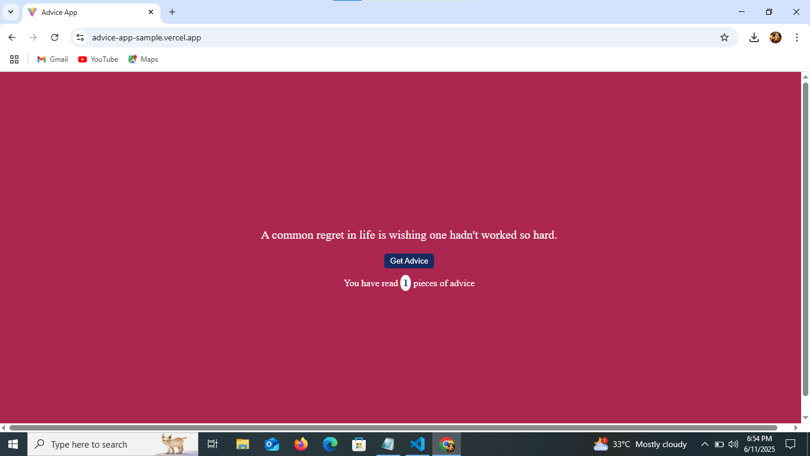
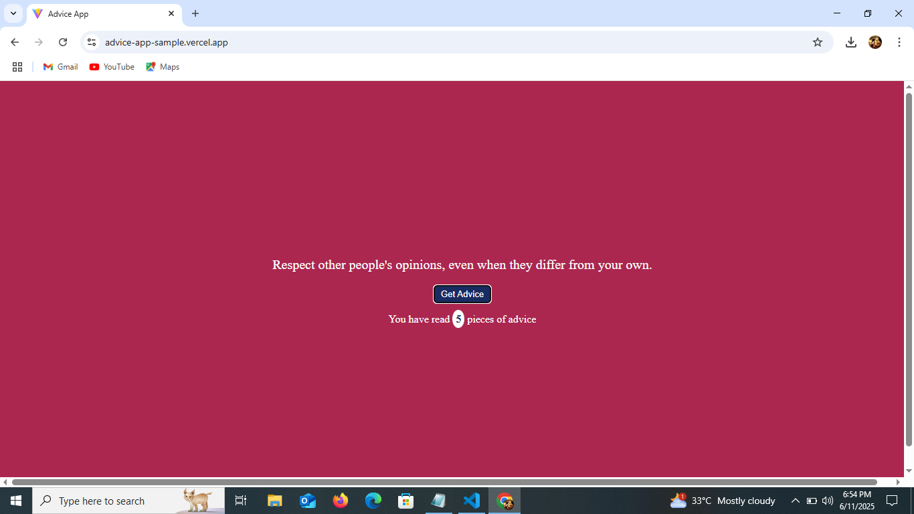

## Developed By  

**Gayathri G**  
GitHub: [@GAYATHRI1006](https://github.com/GAYATHRI1006)

## Screenshot

  

  

## Features

- Fetches random advice from API
- Tracks how many pieces of advice you’ve read
- Clean UI with dynamic content
- Uses React Hooks: `useState` and `useEffect`

## Getting Started

### 1. Clone the Repository

```bash
git clone https://github.com/GAYATHRI1006/Advice_App.git
```

### 2. Install Dependencies

```bash
npm install
```

### 3. Run the App

```bash
npm run dev
```

## Tech Stack

- **React**
- **JavaScript**
- **HTML5**
- **CSS3**
    
## API Used

This app uses the [Advice Slip API](https://api.adviceslip.com/advice) to fetch random advice.
